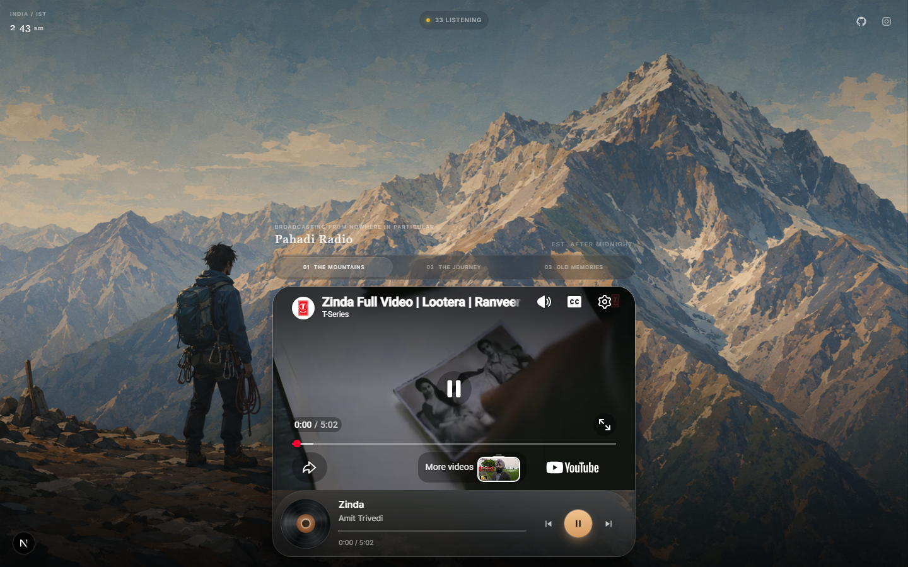
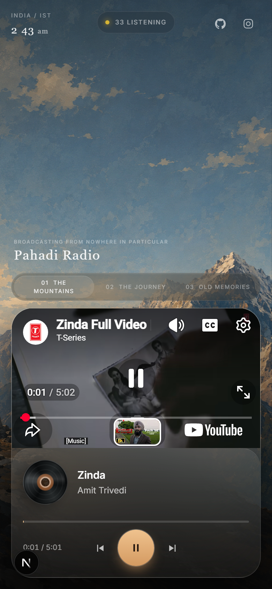

# Pahadi Radio

> A little radio station somewhere in the mountains.

A single-page nostalgia radio experience where Indian music, quiet roads, and a cinematic mountain landscape meet.

[View the repository](https://github.com/isthatpratham/pahadi-radio)

## Preview

<p align="center">
  
</p>

<p align="center">
  
</p>

Pahadi Radio is shaped by mountains, wandering, solitude, old memories, and late-night listening. It is designed to feel like a place, not another streaming dashboard.

## Features

- Cinematic landscape and portrait mountain artwork
- Live IST clock and a locally generated fictional listener count
- Three curated playlists with play, pause, previous, next, and seeking controls
- Vinyl-inspired playback UI with distinct desktop and mobile layouts
- Visible YouTube playback with automatic advancement and error recovery
- Responsive safe-area support, keyboard controls, and reduced-motion handling
- Vercel Analytics, Speed Insights, social links, and App Router favicon metadata

## Tech stack

| Technology | Version | Purpose |
|---|---:|---|
| Next.js | 16.3.0 | App Router and application framework |
| React | 19.2.8 | Interactive station UI |
| TypeScript | 7.0.2 | Type safety |
| Tailwind CSS | 4.3.3 | Styling and theme tokens |
| YouTube IFrame Player API | Runtime API | Music playback |
| Vercel Analytics | 2.0.1 | Playback analytics |
| Vercel Speed Insights | 2.0.0 | Performance insights |

## Architecture

```text
Next.js App
    │
    ├── Page / mountain artwork
    │
    └── RadioStation
          ├── Playlists
          ├── Desktop + mobile controls
          ├── Vinyl animation
          └── YouTube playback engine
```

The page and artwork are rendered by the App Router. `RadioStation` owns the interactive state, while `YouTubePlayer` isolates API loading, playback lifecycle, and error handling.

## Project structure

```text
app/                 Page shell, metadata, and global styles
components/          Station interface and YouTube player
data/playlists.ts    Curated tracks and playlists
types/               Music and YouTube types
public/bg/           Landscape, portrait, and favicon artwork
public/screenshots/  README previews
package.json         Scripts and dependencies
```

## Run locally

```bash
git clone https://github.com/isthatpratham/pahadi-radio.git
cd pahadi-radio
npm install
npm run dev
```

Open [http://localhost:3000](http://localhost:3000). No environment variables are required by the current implementation.

## Music

Music is streamed through configured video IDs using the YouTube IFrame Player API. Pahadi Radio does not download or re-host the recordings; playback state, duration, and availability come from the embedded player.

## Design

The mountain landscape is the main visual. The interface stays intentionally minimal: a vinyl represents the station, while the glass player sits inside the landscape instead of behaving like a conventional streaming dashboard.

## Inspiration

Pahadi Radio is inspired by the recent wave of experimental, nostalgic, single-purpose websites shared through Instagram Reels and social media. [Deluxe Saloon](https://www.deluxesaloon.space/) is one example of how a website can be an experience in itself rather than a collection of features.

Pahadi Radio is an independent project—not affiliated with or a clone of Desi Saloon—and takes that spirit somewhere else: a small radio station in the mountains.

---

Pahadi Radio is a small experiment in making the web feel like somewhere you can go: a mountain, a little music, and a few quiet minutes away from everything else.
