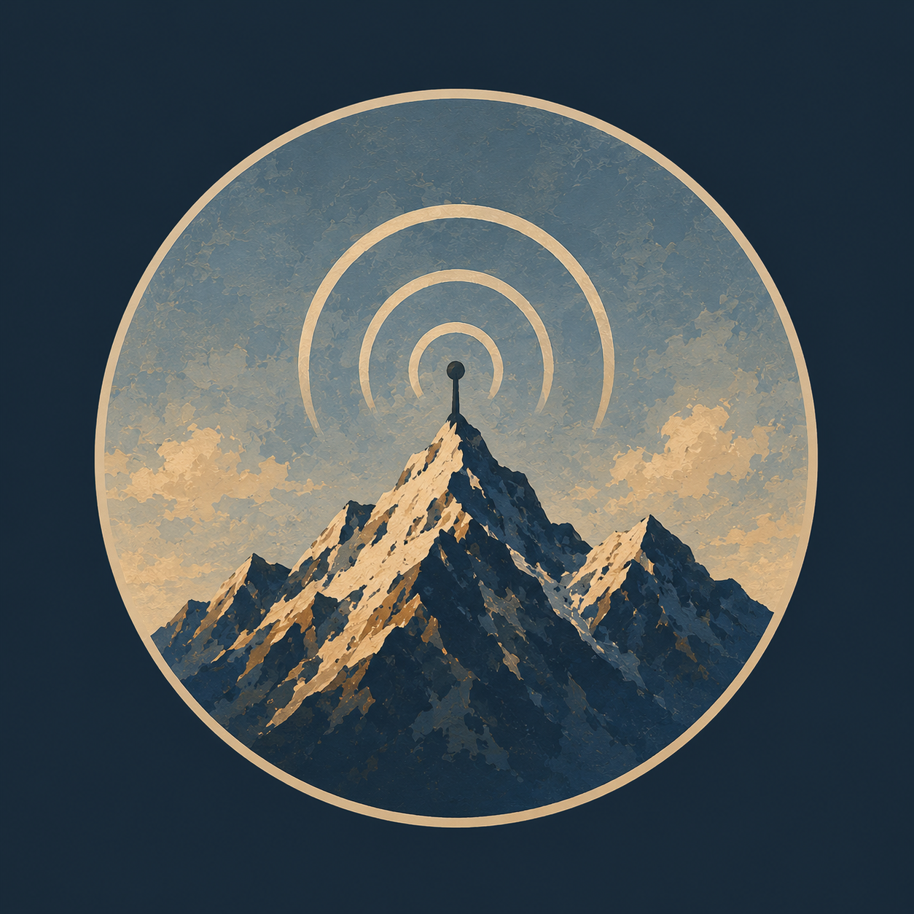

# Pahadi Radio

> A little radio station somewhere in the mountains.

Pahadi Radio is a single-page nostalgia radio experience shaped by mountains, solitude, wandering, old memories, and music. A cinematic landscape fills the screen while a small station interface keeps the focus on the atmosphere rather than turning the experience into a conventional streaming dashboard.

[View the repository](https://github.com/isthatpratham/pahadi-radio)

<p align="center">
  
</p>

## About

The project is designed to feel like a place: a late-night radio discovered somewhere high in the mountains. The interface combines a live India Standard Time clock, a fictional listener indicator, three curated playlists, a vinyl-inspired playback object, and a visible YouTube player inside a restrained glass panel.

It is intentionally small. There are no accounts, recommendations, dashboards, search systems, databases, or backend services.

## Preview

The repository currently contains the application artwork, but no UI screenshots.

### Desktop

<!-- Add a desktop application screenshot here. -->

### Mobile

<!-- Add a mobile application screenshot here. -->

`scene-wide.png`, `scene-tall.png`, and `favicon.png` are source artwork—not application screenshots.

## Features

- Full-screen mountain artwork with separately composed landscape and portrait images
- Orientation-aware artwork switching through CSS
- Subtle grain and cinematic shadow overlays
- India Standard Time clock with a blinking colon
- Fictional, locally generated listener count
- GitHub and Instagram links
- Three curated playlists: **The Mountains**, **The Journey**, and **Old Memories**
- 15 shared track records across 18 playlist entries
- Visible YouTube IFrame Player API integration with one stable player instance
- Play, pause, previous, next, pointer-based seeking, and elapsed/duration display
- Automatic track advancement and session-level skipping of failed video sources
- Playback-driven vinyl animation
- Independently composed desktop and mobile control layouts
- Keyboard-accessible seek control, visible focus states, and touch-friendly transport buttons
- Safe-area support for modern mobile devices
- Vercel Analytics events and Vercel Speed Insights
- App Router metadata with the Pahadi Radio favicon

## Tech stack

| Technology | Version | Purpose |
|---|---:|---|
| [Next.js](https://nextjs.org/) | 16.3.0 | App Router, metadata, static page generation |
| [React](https://react.dev/) | 19.2.8 | Client-side station and playback UI |
| [TypeScript](https://www.typescriptlang.org/) | 7.0.2 | Strict type checking |
| [Tailwind CSS](https://tailwindcss.com/) | 4.3.3 | Utility styling and CSS theme tokens |
| `@tailwindcss/postcss` | 4.3.3 | Tailwind PostCSS integration |
| [YouTube IFrame Player API](https://developers.google.com/youtube/iframe_api_reference) | Runtime API | Visible embedded playback |
| Vercel Analytics | 2.0.1 | Playback and playlist events |
| Vercel Speed Insights | 2.0.0 | Frontend performance telemetry |

Tailwind is configured directly through `app/globals.css` with `@theme`; there is no `tailwind.config.*` file. The project also uses Next.js defaults without a custom `next.config.*`.

## Architecture

```text
app/page.tsx (Server Component)
        │
        ├── full-screen artwork, gradient, and grain
        │
        └── RadioStation (Client Component)
                │
                ├── clock / listeners / social links
                ├── playlist and track state
                ├── desktop and mobile controls
                ├── analytics events
                │
                └── YouTubePlayer
                        ├── singleton API script loader
                        ├── stable YT.Player instance
                        ├── lifecycle and error handling
                        └── visible iframe

data/playlists.ts
        └── shared track objects → three playlist arrays
```

The root page remains a Server Component. Browser-only behavior is isolated in module-scoped Client Components. Playback state lives in `RadioStation`, while `YouTubePlayer` owns API loading, player creation, video changes, callbacks, and cleanup.

## Project structure

```text
.
├── app/
│   ├── globals.css          # Tailwind v4 theme, artwork, player, and responsive styles
│   ├── layout.tsx           # Metadata, viewport, favicon, analytics
│   └── page.tsx             # Server-rendered page shell
├── components/
│   ├── radio-station.tsx    # Station UI, controls, state, playlists, analytics
│   └── youtube-player.tsx   # YouTube API loader and player lifecycle
├── data/
│   └── playlists.ts         # Approved tracks and playlist membership
├── public/bg/
│   ├── favicon.png
│   ├── scene-tall.png
│   └── scene-wide.png
├── types/
│   ├── music.ts
│   └── youtube.d.ts
├── postcss.config.mjs
├── tsconfig.json
└── package.json
```

There is no `lib/` directory, backend, API route, database, or state-management library.

## How it works

### Artwork and responsive composition

`scene-wide.png` is used in landscape orientation and `scene-tall.png` in portrait orientation. Both are loaded as fixed CSS backgrounds, so React playback updates do not remount the artwork. Safe-area insets protect the fixed interface on mobile devices.

### Playlists and tracks

`data/playlists.ts` defines 15 approved track objects. Playlist arrays reference those shared objects, allowing tracks such as “Zinda,” “Iktara,” and “Sawaar Loon” to appear in more than one playlist without duplicating metadata.

### Playback

The client loads the YouTube IFrame API once and creates one `YT.Player`. Track changes reuse that instance through `loadVideoById` or `cueVideoById`. The UI only enters its playing state after YouTube reports `PLAYING`.

Playback progress is read approximately every 400 ms while playing. The runtime duration comes from YouTube, seeking calls `seekTo`, and the vinyl's animation state follows actual playback. `ENDED` advances to the next playable track.

If YouTube rejects a source, the station records the video ID as unavailable for the current session, emits a `youtube_error` analytics event, and tries the next track without repeatedly retrying the failed source.

### Analytics

The project mounts `Analytics` and `SpeedInsights` in the root layout. Playback emits:

- `track_play`
- `track_pause`
- `track_next`
- `track_previous`
- `track_ended`
- `playlist_change`
- `youtube_error`

No custom analytics backend is present.

## Running locally

Requirements:

- Node.js with npm
- A browser that supports the YouTube IFrame Player API
- Network access to YouTube for playback

```bash
git clone https://github.com/isthatpratham/pahadi-radio.git
cd pahadi-radio
npm install
npm run dev
```

Open [http://localhost:3000](http://localhost:3000).

No environment variables are required by the current implementation.

## Build and validation

```bash
# Strict TypeScript validation
npm run typecheck

# Production build
npm run build

# Run the production server after building
npm start
```

There is currently no lint script or automated test suite in the repository.

## Music and content notes

- The active catalog contains explicitly configured YouTube video IDs.
- The application does not download, extract, or re-host YouTube audio or thumbnails.
- The visible YouTube player is the runtime authority for duration, playback state, and embedding availability.
- Most catalog `duration` values are intentionally empty because the displayed duration is read from the player.
- New sources should only be added when their use is authorized and embedding is enabled.
- Music, film metadata, recordings, and YouTube-hosted media remain subject to their respective owners' rights and platform terms.

To add an approved source, create one typed track object in `data/playlists.ts` and reference that same object from the appropriate playlist arrays:

```ts
{
  id: "track-id",
  title: "Track title",
  artist: "Artist",
  film: "Film or Indie",
  year: 2026,
  duration: "",
  videoId: "APPROVED_VIDEO_ID",
}
```

`APPROVED_VIDEO_ID` is documentation syntax, not a bundled source.

## Design philosophy

The mountain should remain still while the music supplies the emotional movement. Pahadi Radio uses warm colors, restrained glass surfaces, small typography, subtle motion, and minimal controls so the interface feels embedded in the scene rather than placed on top of it.

Desktop and mobile controls are composed separately, but share the same playback engine. Motion is limited to meaningful details such as the clock colon and vinyl, with reduced-motion preferences respected.

## Inspiration

Pahadi Radio draws from long mountain journeys, quiet roads, late-night listening, old Hindi film music, Indian indie music, and the intimacy of small independent radio spaces. Desi Saloon is part of that broader reference point: radio as atmosphere, companionship, and a sense of place rather than a catalog to browse.

## Closing

Pahadi Radio is deliberately modest in scope: one landscape, a few playlists, and music playing somewhere in the distance. The goal is not to become another streaming platform. It is to preserve a feeling.

## License and usage

The repository does not currently include a root `LICENSE` file. Although `package.json` declares `MIT`, licensing should be clarified with an actual license file before reusing the source.

The artwork and music are separate creative works and are not automatically covered by the package metadata. Confirm the applicable rights before redistributing either.
